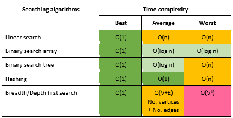
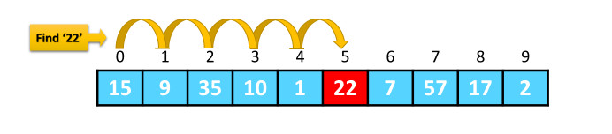
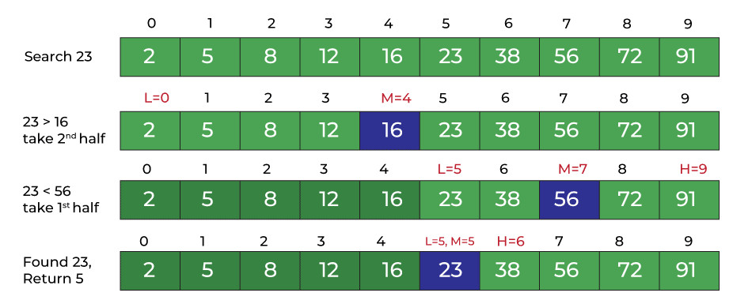

# Searching Algorithms

- [Searching Algorithms](#searching-algorithms)
  - [Linear Search](#linear-search)
    - [Python implementation](#python-implementation)
    - [Complexity analysis](#complexity-analysis)
  - [Binary Search](#binary-search)
    - [Iterative Method](#iterative-method)
    - [Recursive Method](#recursive-method)
    - [Complexity analysis](#complexity-analysis-1)



## Linear Search

Linear search is a sequential searching algorithm where we start from one end and check every element of the list until the desired element is found. It is the simplest searching algorithm.

> For searching operations in smaller arrays (<100 items).



### Python implementation

[linear-search.py](../../code/sorting/linear-search.py)

```python
def linear_search(x, arr):

    # Going through array sequencially
    for i in range(0, len(arr)):
        if arr[i] == x:
            return i
    return -1
```

### Complexity analysis

- Time Complexity: O(n)
- Space Complexity: O(1)

## Binary Search

Binary Search is a searching algorithm for finding an element's position in a sorted array. In this approach, the element is always searched in the middle of a portion of an array.

> **Binary search can be implemented only on a sorted list of items. If the elements are not sorted already, we need to sort them first.**



Binary Search Algorithm can be implemented in two ways:.

1. Iterative Method
2. Recursive Method

### Iterative Method

[binary-search-iterative.py](../../code/sorting/binary-search-iterative.py)

```python
def binary_search(x, arr):

    low = 0
    high = len(arr) - 1

    # Repeat until the pointers low and high meet each other
    while low <= high:

        mid = low + (high - low) // 2

        # If found at mid, then return it
        if arr[mid] == x:
            return mid

        # Search the right half
        elif arr[mid] < x:
            low = mid + 1

        # Search the left half
        else:
            high = mid - 1

    return -1
```

### Recursive Method

[binary-search-recursive.py](../../code/sorting/binary-search-recursive.py)

```python
def binary_search(x, arr, low=None, high=None):

    low = 0 if not low else low
    high = len(arr) - 1 if not high else high

    if low <= high:
        mid = low + (high - low) // 2

        # If found at mid, then return it
        if arr[mid] == x:
            return mid

        # Search the right half
        elif arr[mid] < x:
            return binary_search(x, arr, mid + 1, high)

        # Search the left half
        else:
            return binary_search(x, arr, low, mid - 1)

    return -1
```

### Complexity analysis

- Time Complexity
  - Best case: O(1)
  - Average Case: O(log n)
  - Worst Case: O(log n)
- Space Complexity: O(1)