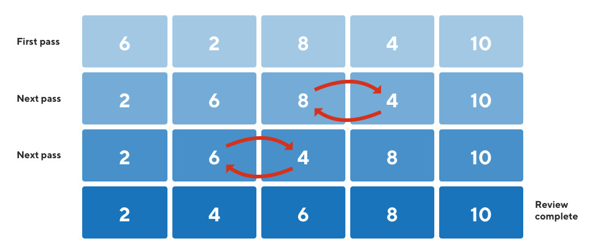
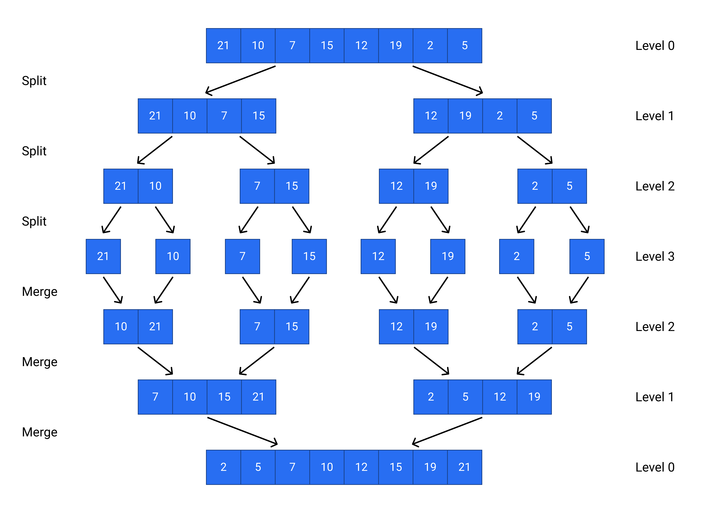

# Sorting Algorithms

Given a sequence of elements, sorting them means that ordering them in a particular fashion. In general, when we talk about sorting, we are talking about ordering them in ascending order.

The most popular sorting algorithms are:

- [Sorting Algorithms](#sorting-algorithms)
  - [Bubble Sort](#bubble-sort)
    - [Python implementation](#python-implementation)
    - [Complexity analysis](#complexity-analysis)
  - [Quick Sort](#quick-sort)
    - [Python implementation](#python-implementation-1)
    - [Complexity analysis](#complexity-analysis-1)
  - [Merge Sort](#merge-sort)
    - [Python implementation](#python-implementation-2)
    - [Complexity analysis](#complexity-analysis-2)

## Bubble Sort

[Bubble sort](https://www.programiz.com/dsa/bubble-sort) is a sorting algorithm that compares two adjacent elements and swaps them until they are in the intended order.

Just like the movement of air bubbles in the water that rise up to the surface, each element of the array move to the end in each iteration. Therefore, it is called a bubble sort.



### Python implementation

[bubble-sort.py](../../code/sorting/bubble-sort.py)

```python
def bubble_sort(arr):

    # Loop to access each array element
    for i in range(len(arr)):

        # Loop to compare array elements
        for j in range(0, len(arr) - i - 1):

            # Compare two adjacent elements
            # Change > to < to sort in descending order
            if arr[j] > arr[j + 1]:

                # Swapping elements if elements are not in the intended order
                temp = arr[j]
                arr[j] = arr[j + 1]
                arr[j + 1] = temp

    return arr
```

### Complexity analysis

- Time Complexity
  - Best case: O(n)
  - Average Case: O(n^2)
  - Worst Case: O(n^2)
- Space Complexity: O(1)

## Quick Sort 

[Quick Sort](https://www.programiz.com/dsa/quick-sort) is one of the most popular and efficient sorting algorithms. It is generally the default sorting algorithms in many programming languages (including C++ and Java).

Even though the worst case time complexity of Quick Sort is **O(n^2)**, it works at **O(n log n)** in most cases and is generally much faster than merge sort if implemented properly.

Quicksort is a divide-and-conquer algorithm. It works by selecting a 'pivot' element from the array and partitioning the other elements into two sub-arrays, according to whether they are less than or greater than the pivot. The sub-arrays are then sorted recursively.


### Python implementation

[quick-sort.py](../../code/sorting/quick-sort.py)

```python
def quick_sort(arr):

    if len(arr) <= 1:
        return arr

    pivot = arr[-1]
    smaller, equal, larger = [], [], []

    for num in arr:
        if num < pivot:
            smaller.append(num)
        elif num == pivot:
            equal.append(num)
        else:
            larger.append(num)

    return quick_sort(smaller) + equal + quick_sort(larger)
```

### Complexity analysis

- Time Complexity
  - Best case: O(n log n)
  - Average Case: O(n log n)
  - Worst Case: O(n^2)
- Space Complexity
  - O(n) for recursion stack.

## Merge Sort

[Merge Sort](https://www.programiz.com/dsa/merge-sort) is also a Divide and Conquer algorithm similar to Quick Sort. The input array right into two parts in the middle. The two parts are then sorted recursively and then merged to create the sorted array.

The algorithm looks something like this:

- Sort the left half of the array
- Sort the right half of the array
- Merge both the halves of the array
- The base case of the recursion is arrays of size zero or one, which are in order by definition, so they never need to be sorted.



### Python implementation

[merge-sort.py](../../code/sorting/merge-sort.py)

```python
def merge_sort(arr):

    if len(arr) > 1:

        #  r is the point where the array is divided into two subarrays
        r = len(arr) // 2
        L = arr[:r]
        M = arr[r:]

        # Sort the two halves
        merge_sort(L)
        merge_sort(M)

        i = j = k = 0

        # Until we reach either end of either L or M, pick larger among
        # elements L and M and place them in the correct position at A[p..r]
        while i < len(L) and j < len(M):
            if L[i] < M[j]:
                arr[k] = L[i]
                i += 1
            else:
                arr[k] = M[j]
                j += 1
            k += 1

        # When we run out of elements in either L or M,
        # pick up the remaining elements and put in A[p..r]
        while i < len(L):
            arr[k] = L[i]
            i += 1
            k += 1

        while j < len(M):
            arr[k] = M[j]
            j += 1
            k += 1

    return arr
```

### Complexity analysis

- Time Complexity
  - Best case: O(n log n)
  - Average Case: O(n log n)
  - Worst Case: O(n log n)
- Space Complexity
  - O(n) for recursion stack.