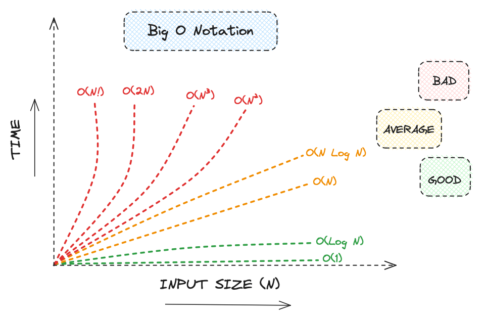
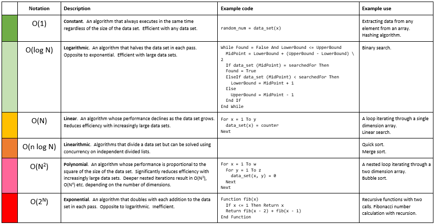

# Big-O Notation

- [Big-O Notation](#big-o-notation)
  - [Definition](#definition)
  - [Complexity Comparison](#complexity-comparison)
    - [O(1) - Constant Time Complexity](#o1---constant-time-complexity)
    - [O(log n) - Logarithmic Time Complexity](#olog-n---logarithmic-time-complexity)
    - [O(n) - Linear Time Complexity](#on---linear-time-complexity)
    - [O(n log n) - Linearithmic Time Complexity](#on-log-n---linearithmic-time-complexity)
    - [O(n^2) - Quadratic Time Complexity](#on2---quadratic-time-complexity)
    - [O(2^n) - Exponential Time Complexity](#o2n---exponential-time-complexity)
    - [O(n!) - Factorial Time Complexity](#on---factorial-time-complexity)
  - [Time Complexity](#time-complexity)
  - [Space Complexity](#space-complexity)
  - [Links](#links)

## Definition

[Big O notation](https://www.geeksforgeeks.org/analysis-algorithms-big-o-analysis/) is a powerful tool used in computer science to describe the time complexity or space complexity of algorithms. It provides a standardized way to compare the efficiency of different algorithms in terms of their worst-case performance. Understanding Big O notation is essential for analyzing and designing efficient algorithms.

> Big-O notation is used to describe the performance or complexity of an algorithm. Specifically, it describes the worst-case scenario in terms of time or space complexity.

In Big O notation:

- **O**: Represents the order of the function
- **f(n)**: Represents the function describing the algorithm's time complexity in terms of the input size **n**.
- **n**: Represents the input size.
- **O(f(n))**: Signifies that the algorithm's time complexity grows no faster than a specific function of "n." Here, "f(n)" is a mathematical function describing how the algorithm's runtime increases as the input size grows.

For example:

- **O(1)**: Constant time complexity, where the algorithm's runtime remains constant regardless of the input size.
- **O(log n)**: Logarithmic time complexity, where the algorithm's runtime grows logarithmically with the input size.
- **O(n)**: Linear time complexity, where the algorithm's runtime grows linearly with the input size.
- **O(n log n)**: Linearithmic time complexity, commonly seen in efficient sorting algorithms like **mergesort** and **heapsort**.
- **O(n^2)**: Quadratic time complexity, where the algorithm's runtime grows quadratically with the input size.

## Complexity Comparison

### O(1) - Constant Time Complexity

- **Description**: Algorithms with constant time complexity execute in a constant amount of time regardless of the input size.
- **Example**: Accessing an element in an array by index.
- **Comparison**: Regardless of the input size, the time is the same.

### O(log n) - Logarithmic Time Complexity

- **Description**: Algorithms with logarithmic time complexity have their runtime grow logarithmically with the input size.
- **Example**: Binary search in a sorted array.
- **Comparison**: As the input size increases, the runtime grows slowly, making it more efficient than linear time complexities.

### O(n) - Linear Time Complexity
- **Description**: Algorithms with linear time complexity have their runtime grow linearly with the input size.
- **Example**: Linear search through an unsorted array.
- **Comparison**: The runtime increases proportionally to the input size.

### O(n log n) - Linearithmic Time Complexity
- **Description**: Algorithms with linearithmic time complexity have their runtime grow in proportion to the input size multiplied by the logarithm of the input size.
- **Example**: Efficient sorting algorithms like mergesort and heapsort.
- **Comparison**: More efficient than quadratic time complexities but less efficient than linear or logarithmic ones.

### O(n^2) - Quadratic Time Complexity
- **Description**: Algorithms with quadratic time complexity have their runtime grow quadratically with the input size.
- **Example**: Nested loops iterating over the input.
- **Comparison**: As the input size increases, the runtime grows quadratically, making it less efficient for large inputs.

### O(2^n) - Exponential Time Complexity
- **Description**: Algorithms with exponential time complexity have their runtime grow exponentially with the input size.
- **Example**: Brute-force algorithms that try all possible combinations.
- **Comparison**: Extremely inefficient for large inputs, as the runtime increases rapidly with even small increases in input size.

### O(n!) - Factorial Time Complexity
- **Description**: Algorithms with factorial time complexity have their runtime grow factorially with the input size.
- **Example**: Algorithms generating all permutations of a set.
- **Comparison**: Highly inefficient, with the runtime growing extremely fast with the input size.

## Time Complexity

Time complexity refers to an algorithm's time to complete its execution as a function of the input size. It helps understand how an algorithm's runtime scales with different input sizes. Time complexity is typically expressed using Big O notation to describe the upper bound of the algorithm's runtime.

## Space Complexity

Space complexity refers to the amount of memory an algorithm uses to execute as a function of the input size. It helps understand how much memory an algorithm requires to store data and execute operations. Similar to time complexity, space complexity is also expressed using Big O notation to describe the upper bound of the algorithm's memory usage.

For example:
- O(1) represents constant space complexity, indicating that the algorithm uses a fixed amount of memory regardless of the input size.
- O(n) represents linear space complexity, where the memory usage grows linearly with the input size.
- O(n^2) represents quadratic space complexity, where the memory usage grows quadratically with the input size.

Analyzing space complexity is essential for understanding the memory requirements of algorithms, optimizing memory usage, and ensuring efficient resource utilization, especially in memory-constrained environments.

## Links

- [https://www.bigocheatsheet.com/](https://www.bigocheatsheet.com/)
- [https://www.freecodecamp.org/news/big-o-cheat-sheet-time-complexity-chart/](https://www.freecodecamp.org/news/big-o-cheat-sheet-time-complexity-chart/)