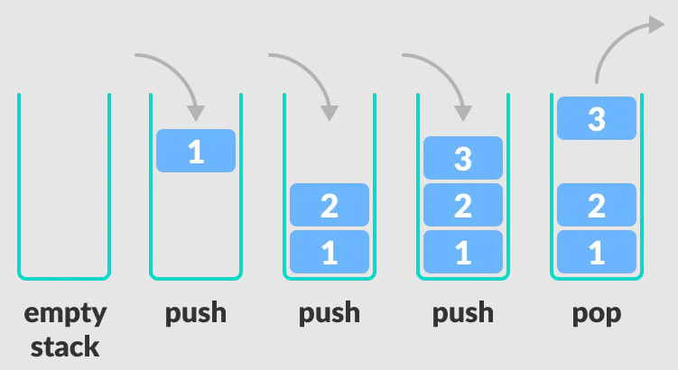

# Stacks

- [Stacks](#stacks)
  - [Using LISTS](#using-lists)
  - [Using DEQUE](#using-deque)

A stack is a linear data structure that follows the principle of **Last In First Out (LIFO)**. This means the last element inserted inside the stack is removed first.

You can think of the stack data structure as the pile of plates on top of another.

> In programming terms, putting an item on top of the stack is called **PUSH** and removing an item is called **POP**.



[stacks.py](../../code/data_structures/stacks.py)

## Using LISTS

Lists are used to store multiple items in a single variable.

Lists are one of 4 built-in data types in Python used to store collections of data, the other 3 are Tuple, Set, and Dictionary, all with different qualities and usage. Lists are created using square brackets.

```python
stack = ["Pablo", "Daniel", "Anthony"]

# PUSH
stack.append("Gabriel")

# POP
print(stack.pop())
```

## Using DEQUE

Python’s **deque** was the first data type added to the collections module back in Python 2.4. This data type was specially designed to overcome the efficiency problems of .append() and .pop() in Python list.

Deques are sequence-like data types designed as a generalization of stacks and queues. They support memory-efficient and fast append and pop operations on both ends of the data structure.

Append and pop operations on both ends of a deque object are stable and equally efficient because deques are implemented as a doubly linked list. Additionally, append and pop operations on deques are also thread safe and memory efficient. These features make deques particularly useful for creating custom stacks and queues in Python.

```python
from collections import deque

stack = deque(["Ram", "Tarun", "Asif", "John"])
stack.append("Akbar")
print(stack.pop())

```