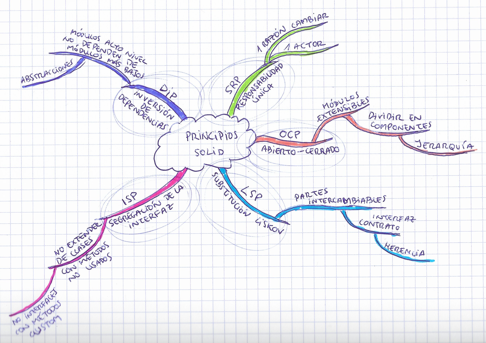

# SOLID Principles

> - Knowledge of SOLID principles and their real-world applications.

- [SOLID Principles](#solid-principles)
  - [Definition](#definition)
  - [List of SOLID Principles](#list-of-solid-principles)

## Definition

**The SOLID principles guide us on how to organize our functions and data structures into classes, and how these classes should be interconnected**. Here, a class is understood as a coupled grouping of functions and data.

The goal of the SOLID principles is to create software structures that:
- Tolerate change
- Are easy to understand
- Serve as the basis for reusable components

These principles apply just above the code level and help define the types of software structures used in modules and components.

## List of SOLID Principles

The SOLID principles are:

- **SRP - Single Responsibility Principle:** Each software module should have one, and only one, reason to change. A module should be responsible for only one actor.

- **OCP - Open-Closed Principle:** Systems should not be modified extensively; they should be easily extensible.

- **LSP - Liskov Substitution Principle:** To create software systems from interchangeable parts, those parts must adhere to a contract that allows them to be replaced by others.

- **ISP - Interface Segregation Principle:** Advises 
- software designers to avoid depending on things they do not use.

- **DIP - Dependency Inversion Principle:** High-level policy code should not depend on low-level detail code. Instead, details should depend on policies.

