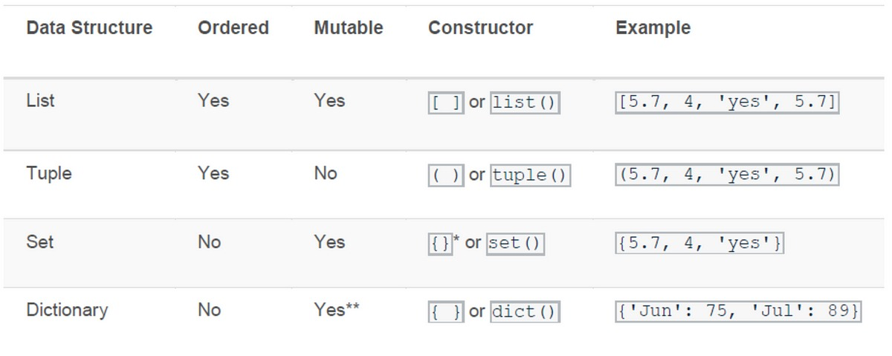

# Built-in Data Types

> Understanding of basic data structures (arrays, lists, maps) and their use cases.

- [Built-in Data Types](#built-in-data-types)
  - [Collection Data Types](#collection-data-types)
    - [List \[\]](#list-)
    - [Tuple ()](#tuple-)
    - [Set {}](#set-)
    - [Dictionary {key: value}](#dictionary-key-value)

## Collection Data Types

Python has 4 built-in data types used to store collections of data: Lists, Tuples, Sets, and Dictionaries. All with different qualities and usage.

- **List**: Collection which is ordered and changeable. Allows duplicate members.
- **Tuple**: Collection which is ordered and unchangeable. Allows duplicate members.
- **Set**: Collection which is unordered, unchangeable*, and unindexed. No duplicate members. (Set items are unchangeable, but you can remove and/or add items whenever you like.)
- **Dictionary**: Collection which is ordered** and changeable. No duplicate members.



### List []

- Lists are used to store multiple items in a single variable.
- Lists are created using square brackets [].
- List items are ordered (have a defined order), changeable, and allow duplicate values.
- Lists are indexed.
- To determine how many items a list has, use the **len()** function.
- List items can be of any data type.
- It is also possible to use the **list()** constructor when creating a new list.

Use cases:
- Storing a list of data.
- Perform operations on data, such as searching, sorting, and merging.

```python
# Creating a list
mylist = ["apple", "banana", "cherry"]
print(mylist)

# Getting list lenght
print(len(mylist))

# Items can be any data type
list1 = ["apple", "banana", "cherry"]
list2 = [1, 5, 7, 9, 3]
list3 = [True, False, False]

# Using the list() constructor
thislist = list(("apple", "banana", "cherry")) # note the double round-brackets
print(thislist)

my_list = [1, 2, 3, 4, 5]

# Accessing elements
print("First element:", my_list[0])  # Output: 1
print("Last element:", my_list[-1])  # Output: 5

# Slicing
print("Sliced elements:", my_list[2:4])  # Output: [3, 4]

# Modifying elements
my_list[0] = 10
print("Modified list:", my_list)  # Output: [10, 2, 3, 4, 5]

# Appending elements
my_list.append(6)
print("Appended list:", my_list)  # Output: [10, 2, 3, 4, 5, 6]

# Removing elements
removed_element = my_list.pop()
print("Removed element:", removed_element)  # Output: 6
print("List after removal:", my_list)  # Output: [10, 2, 3, 4, 5]

# Iterating through the list
print("List elements:")
for element in my_list:
    print(element)

# Length of the list
print("Length of the list:", len(my_list))  # Output: 5

# Checking if an element exists in the list
if 3 in my_list:
    print("3 exists in the list.")
else:
    print("3 doesn't exist in the list.")

# Concatenating lists
another_list = [7, 8, 9]
concatenated_list = my_list + another_list
print("Concatenated list:", concatenated_list)  # Output: [10, 2, 3, 4, 5, 7, 8, 9]
```

### Tuple ()

Tuple is a collection data type similar to a list, but its data cannot be changed (**unchangeable**). Tuples are denoted by parentheses ().

- Tuples are ordered. It means that the items have a defined order, and that order will not change.
- Tuples are **unchangeable**, meaning that we cannot change, add or remove items after the tuple has been created.
- Since tuples are **indexed**, they can have items with the same value.
- To determine how many items a tuple has, use the **len()** function.

Use cases:
- Storing a collection of data that will not change.
- Use Performing operations on data, such as searching and sorting.

```python
# Creating a tuple
my_tuple = (1, 2, 3, "a", "b", "c")
print(my_tuple)

# Accessing elements of a tuple
print("First element:", my_tuple[0])  # Output: 1
print("Last element:", my_tuple[-1])  # Output: 'c'

# Iterating over a tuple
for item in my_tuple:
    print(item)

# Tuple unpacking
x, y, z, a, b, c = my_tuple
print("Unpacked values:", x, y, z, a, b, c)
```

### Set {}

Set is a collection data type that only stores unique data. Sets are denoted by curly braces {}.

- Sets are unordered. That means that the items in a set do not have a defined order. Set items can appear in a different order every time you use them, and cannot be referred to by index or key.
- Set items are unchangeable, meaning that we cannot change the items after the set has been created. Once a set is created, you cannot change its items, but you can remove items and add new items.
- Sets cannot have two items with the same value.

Use cases:
- Storing a unique collection of data.
- Performing operations on data, such as searching and sorting.

```python
# Creating a set
fruits = {"apple", "banana", "orange", "apple", "pear"}

# Adding elements to a set
fruits.add("grape")

# Removing an element from a set
fruits.remove("orange")

# Checking if an element is in the set
print("Is 'banana' in the set?", "banana" in fruits)  # Output: True
print("Is 'kiwi' in the set?", "kiwi" in fruits)  # Output: False

# Iterating over a set
print("Fruits in the set:")
for fruit in fruits:
    print(fruit)

# Operations on sets
set1 = {1, 2, 3, 4, 5}
set2 = {4, 5, 6, 7, 8}

# Union of sets
union_set = set1.union(set2)
print("Union of set1 and set2:", union_set)  # Output: {1, 2, 3, 4, 5, 6, 7, 8}

# Intersection of sets
intersection_set = set1.intersection(set2)
print("Intersection of set1 and set2:", intersection_set)  # Output: {4, 5}

# Difference of sets
difference_set = set1.difference(set2)
print("Difference of set1 and set2:", difference_set)  # Output: {1, 2, 3}

# Check if a set is a subset
subset_check = {1, 2}.issubset(set1)
print("{1, 2} is a subset of set1:", subset_check)  # Output: True
```

### Dictionary {key: value}

Dict (Dictionary) is a collection data type that stores data in the form of key-value pairs. Dictionaries are also denoted by curly braces {}.

- As of Python version 3.7, dictionaries are ordered. In Python 3.6 and earlier, dictionaries are unordered.
- Dictionaries are changeable, meaning that we can change, add or remove items after the dictionary has been created.
- Dictionaries cannot have two items with the same key.
- To determine how many items a dictionary has, use the **len()** function.
- The values in dictionary items can be of any data type.
- It is also possible to use the dict() constructor to make a dictionary.

Use cases:
- Storing a collection of data with key-value pairs.
- Performing operations on data, such as searching, sorting, and merging.

```python
# Creating a dictionary
student_scores = {"Alice": 85, "Bob": 90, "Charlie": 75}

# Accessing values
print("Bob's score:", student_scores["Bob"])

# Adding a new key-value pair
student_scores["David"] = 80

# Modifying a value
student_scores["Charlie"] = 78

# Removing a key-value pair
del student_scores["Alice"]

# Iterating over keys and values
for name, score in student_scores.items():
    print(name, "'s score:", score)
```